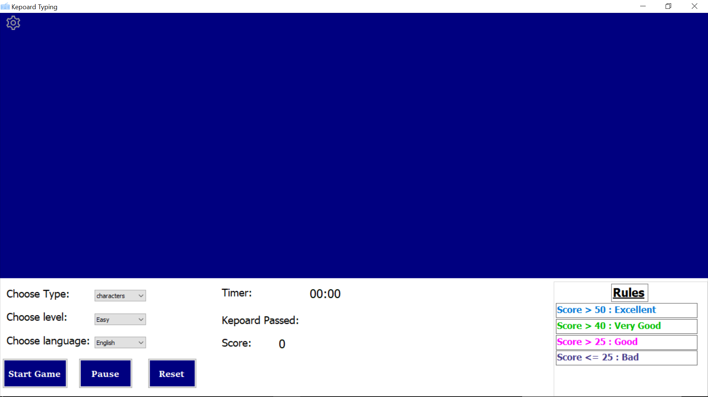

# ⌨️ لعبة تعليم الطباعة السريعة | Typing Speed Trainer

🎮 لعبة ممتعة وتعليمية لتطوير مهارات الكتابة السريعة على الكيبورد باللغة **العربية** و**الإنجليزية**!  
تنفع للطلاب، المبرمجين، أو أي شخص حاب يرفع مستواه في الكتابة 🧠⚡

---

## 📌 فكرة اللعبة

تسقط عليك حروف وأرقام **بشكل عشوائي** حسب السرعة اللي تختارها،  
وهدفك إنك تضغط الزر الصحيح في اللحظة المناسبة.  
لو ضغطت صح → تكسب نقطة ✅  
لو غلطت أو تأخرت → تخسر 💥

---

## 🧠 الميزات

- 💬 دعم الحروف **العربية والإنجليزية**
- 🧮 دعم الأرقام العشوائية
- 🎚️ تحكم كامل في **مستوى الصعوبة والسرعة**
- 🖥️ واجهة بسيطة وسريعة باستخدام Windows Forms
- 🚀 لا تحتاج لتثبيت! فقط انسخ وشغّل!

---

## 🛠️ التقنيات المستخدمة

- ✔️ **C#**
- ✔️ **Windows Forms (WinForms)**
- ✔️ بدون أي مكتبات خارجية – خفيف وسريع التشغيل 💨

---

## 📸 صورة من داخل اللعبة

📌 *(screenshots/typing-game.png))*

```markdown

